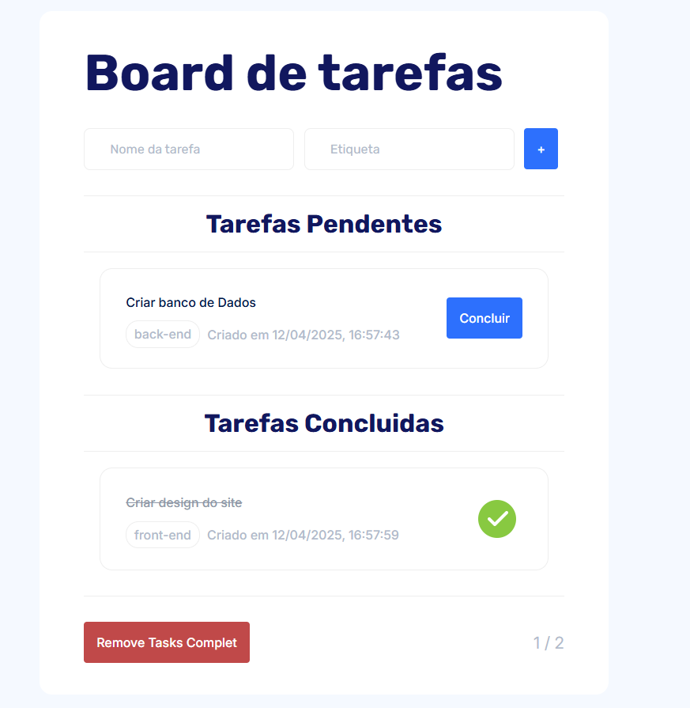

<h1 align="center" style="font-weight: bold;">ToDo List com DragOperations💻</h1>

 <a href="#tech">Technologies</a> • 
 <a href="#started">Getting Started</a> • 

    <b>
      Responsive ToDo-list an application in HTML, CSS and JavaScript that creates, deletes, marks as completed all tasks and saves them in the local storage
      Reads and creates the list, changes the state and deletes with a CRUD
      Uses Promises to simulate saving in the database
      Refactored to separate functionalities
      Dragon and dragdrop function to change tasks from completed to pending list
      Semantic Tags, Measurement units such as rem, % and (vh, vw), JavaScript using array of objects, promises, asynchronous and synchronous functions, local storage, Map, Filter, constants, variables, eventlisteners
    </b>

     <a href="https://thalesfortes.github.io/ToDo-List/">📱 Visit this Project</a>

<h2 id="layout">🎨 Layout</h2>

      

<h2 id="technologies">💻 Technologies</h2>

- HTML5
- CSS3
- JavaScript

<h2 id="started">🚀 Getting started</h2>

- Just download the project with its assets and run it with liveserve or just by opening the html document

